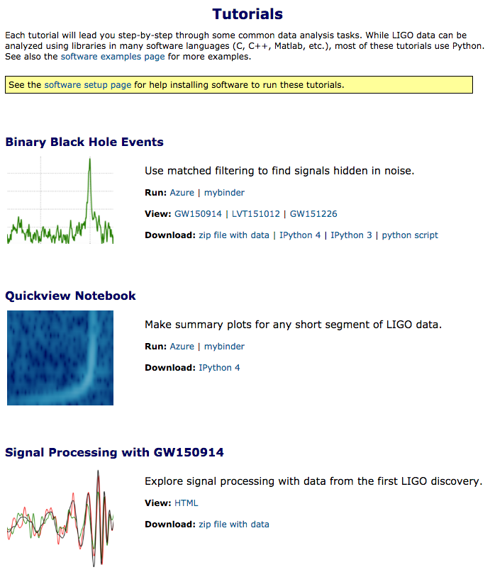
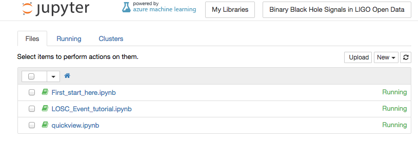

# LIGO

LIGO Scientific Collaboration is a group of more than 1000 scientists worldwide who have joined together in the search for gravitational waves.

February 11, 2016

In a major first for astronomy, scientists have observed ripples in the fabric of spacetime called gravitational waves, arriving at the earth from a cataclysmic event in the distant universe. They confirmed a major prediction of Albert Einstein’s  general theory of relativity and they did it with help from Microsoft's Azure. 

The collision of a pair of black holes orbiting around each other occurs as they slowly lose energy through the emission of gravitational waves, analogous to the way orbiting charged particles lose energy by emitting elecromagnetic energy. 
They gradually approach each other over billions of years, until they collide. During the final fraction of a second, the emissions increase as two black holes merge to form a single more massive black hole. This energy is emitted as a final strong burst of gravitational waves. It is these gravitational waves that LIGO has observed.

With curved spacetime, our conventional notion of Euclidean geometry breaks down, and common invariants are no longer constants, like the sum of the angles that make up a triangle, or the ratio of the diameter to the circumfrence of a circle. If this sounds weird, it really is. A gravitational wave causes a disturbance in spacetime, detectable as barely discernable deviations in distances as measured by long baseline laser inferometry, in this case 4km. So fundamentally the premise LIGO set out to prove is that by extremely precise measurements of changes in distance over time, if one waits long enough, eventually a black hole collision somewhere in the universe will be detectable. 

The LIGO experiment, specifically created to prove this notion was initiated in 1992, in the hope of detecting just such an event. To the jubilation of the scientific community, gravitational waves were detected on September 14, 2015 at 09:51 UTC by both of the twin Laser Interferometer Gravitational-wave Observatory (LIGO) detectors, located in Livingston, Louisiana, and Hanford, Washington, USA. 

## Rerunning the experimental analysis that proved the theory

The LIGO Open Science Center has made Jupyter notebooks with the experimental analysis available in Azure's Notebook Libraries. The analysis of the signals that demonstrated the event was done in using Python notebooks running on Azure.  You can re-run these notebooks which are shared on Azure, and duplicate the experiment on the original data.  Of course you'll need to login into your Azure account to run them. 

### Notebook Library: "Binary Black Hole Signals in LIGO Open Data"

There are links to the notebooks on the [Ligo Open Science Center](https://losc.ligo.org/tutorials/) page, along with links to view the html versions notebooks with the results shown, or just download the data. These options are shown on the tutorials page. 

 

You can _View_ the "Quickview" notebook to see just the results, or view the full signal processing tutorial.  Alternately any of the _Run_ link launches the LIGO Azure Notebooks in your browser. 

The Notebook home page 

 

There are three notebooks that you should see on the Azure Notebooks home page for the Ligo tutorial: 

- The _quickview.ipynb_ can run immediately to see just the results. 
- _First_start_here.ipynb_ is a pre-requisite for the more comprehensive tutorial notebook, 
- _LOSC_Event_tutorial.ipynb._

The tutorial starts with the strain data from the detectors, full of noise, and finds the gravitational-wave signal within.

## The scientific significance is clear - what is the significance for the cloud, specifically for Azure

Thanks to __, one of the early developers of Ipthyton, the 

It's refreshing to see the benefits that can come from the combination of open access to data and widespread availability of 
- Data analysis tools used in the most advanced scientific work are available in the cloud to anyone
- The cloud has made sharing of results a widespread practice in peer reviewed work
- Azure's support of notebooks is a versatile, mature "industrial strength" service. 

### References
- Original paper
"Observation of Gravitational Waves from a Binary Black Hole Merger"
Phys. Rev. Lett. 116, 061102 (2016).

- LIGO Open Science Center
https://losc.ligo.org/about/

